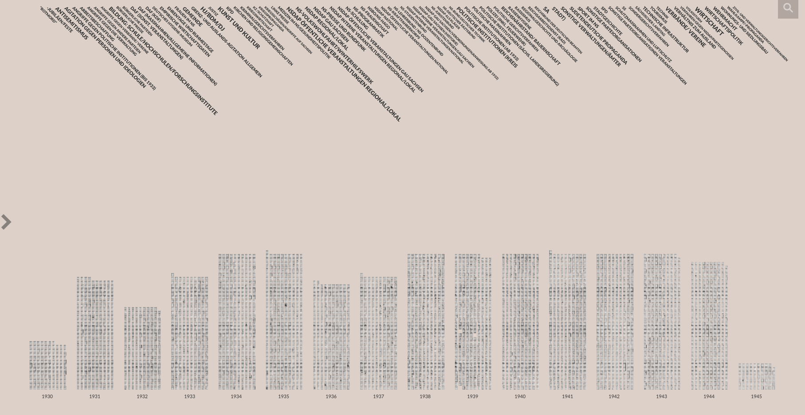

# HAIT-VikusViewer

Test the [Viewer](timops102.github.io/HAIT_vikusviewer/)

This tool is a visualization of the project Freiheitskampf of the Hannah-Arendt Institute for Research on Totalitarianism e.V. in Dresden. Link to the project:
[https://hait.tu-dresden.de/ext/forschung/der-freiheitskampf.asp](https://hait.tu-dresden.de/ext/forschung/der-freiheitskampf.asp)

The goal of this tool is to make the database of the "Freiheitskampf" more accessible for researchers. It should be noted that the "Freiheitskampf" is a Nazi newspaper from the GAU Saxony. Accordingly, partly disturbing contents can be read in the newspaper. 
Furthermore, it should be mentioned that the scans were made by the SLUB Dresden and also there are the original newspapers. In total, the SLUB Dresden owns over 66,000 excerpts of the newspaper. 
Discussions about concerns about copyright infringement, and free access to a Nazi newspaper can be read here (from page 163): 

Hanzig, Christoph, Martin Munke, und Michael Thoß. „Digitising and Presenting a Nazi Newspaper“. In Digitised Newspapers – A New Eldorado for Historians?, herausgegeben von Estelle Bunout, Maud Ehrmann, und Frédéric Clavert, 153–72. De Gruyter, 2022. https://doi.org/10.1515/9783110729214-008. 
URL:[https://www.degruyter.com/document/doi/10.1515/9783110729214-008/html](https://www.degruyter.com/document/doi/10.1515/9783110729214-008/html)

Timeline:
The viewer shows all title pages per year of publication of the daily newspapers. Clicking on a title page opens a detailed view in which references to the original entry stored in the SLUB appear, as well as to all articles that have been manually read through by researchers and enriched with metadata.

Keywords:
In the upper half of the tool, there is a list of keywords created by HAIT researchers. Each read article was tagged with one or more keywords. Thus, after clicking on the keywords, the newspapers can be sorted by articles with this content.

Search function:
In the upper right corner there is a search field. In this search field you can search for a specific date of the newspaper in the format dd.mm.yyyy, or for any term that appears in the article headlines or keywords. Afterwards the newspapers are presented, which contain this search query.

 
The project is a clone of the VIKUS Viewer, which is described in more detail below. There is also the documentation and explanation, if you want to customize the project. 

# VIKUS Viewer

The original [VIKUS Viewer](https://github.com/cpietsch/vikus-viewer).

[VIKUS Viewer](https://vikusviewer.fh-potsdam.de/) is a web-based visualization system that arranges thousands of cultural artifacts on a dynamic canvas and supports the exploration of thematic and temporal patterns of large collections, while providing rapid access to high-resolution imagery.

## Credits

VIKUS Viewer was designed and developed by Christopher Pietsch. 
The VIKUS Viewer software is based on the visualization code behind [Past Visions](https://github.com/cpietsch/fw4), a collaborative effort by Katrin Glinka, Christopher Pietsch, and Marian Dörk carried out at the University of Applied Sciences Potsdam in the context of the Urban Complexity Lab during the research project VIKUS (2014-2017). Related Paper: [Past Visions and Reconciling Views]( http://www.digitalhumanities.org/dhq/vol/11/2/000290/000290.html). 
The T-SNE view has been implemented for the [Sphaera project](https://sphaera.mpiwg-berlin.mpg.de/) with funding from [Chronoi-REM](https://www.berliner-antike-kolleg.org/rem)

### Notes for the image data
 
The image data for the HAIT-VikusViewer is located internally on a HAIT server. To allow URLS other than this [GitHubPage](timops102.github.io/HAIT_vikusviewer/) to access the images, the URL to access from must be changed in the .htaccess on the HAIT server.

## License

You may use VIKUS Viewer under the terms of the MIT License. See http://en.wikipedia.org/wiki/MIT_License for more information.
Copyright (C) 2017-2021 Christopher Pietsch, and contributors

